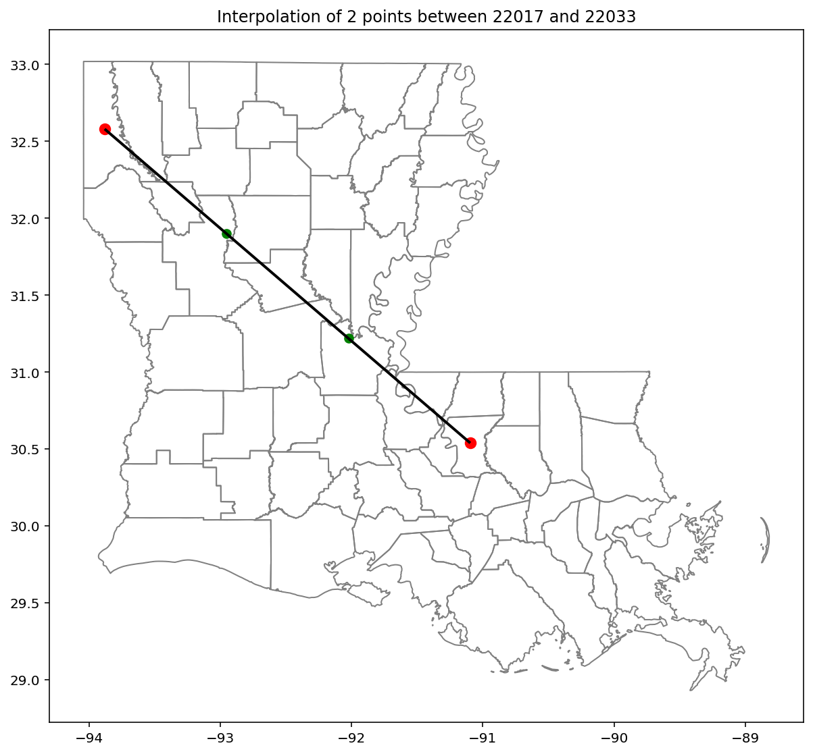

-----------------------------------------------------------------------------------
Github Repo for Spatial Inference on Phylogenetic Trees
-----------------------------------------------------------------------------------

Before running anything please make sure you have libraries installed under requirements.txt

-----------------------------------------------------------------------------------

Data

-----------------------------------------------------------------------------------

- la_cbg.csv: the transition matrix for CBG level imputation
- la_county.csv: the transition matrix for county level imputation 
- us_county_reporting_probs.csv: is the emission matrix for county level, and CBG level (see note)

- for shape files, paper_data/map/map contains shape files for both CBG and county level. 

***NOTE*** 
Outdated data between CBG level shape file and simulation CBG dataset will inevitably cause exceptions to be thrown. 
CBG level emission matrix is not available, it uses us_county....probs but will remain constant accross all CBGs. 

-----------------------------------------------------------------------------------

Code

-----------------------------------------------------------------------------------

- mapping.py: Linear interpolation. Values for interpolated nodes are saved in node.baseline
- constant.py: Constant interpolation, must follow specific format specified in file, imputes root of branch to all child nodes. 
- viterbi.py: Runs both viterbi and linear interpolation on dataset. Set random flag to impute random interpolation.
- viterbi_sim.py: Runs both viterbi and linear interpolation on dataset. Set random flag to impute random interpolation.

***NOTE*** 
For viterbi and viterbi_sim, setting random flag will not run viterbi or linear interpolation. 
